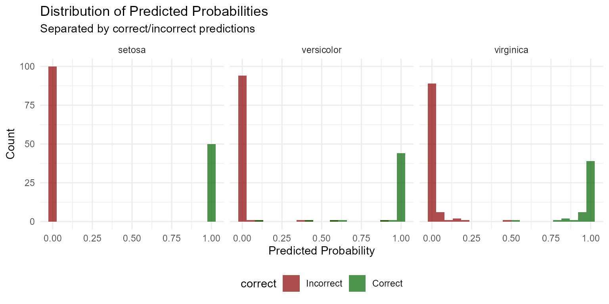
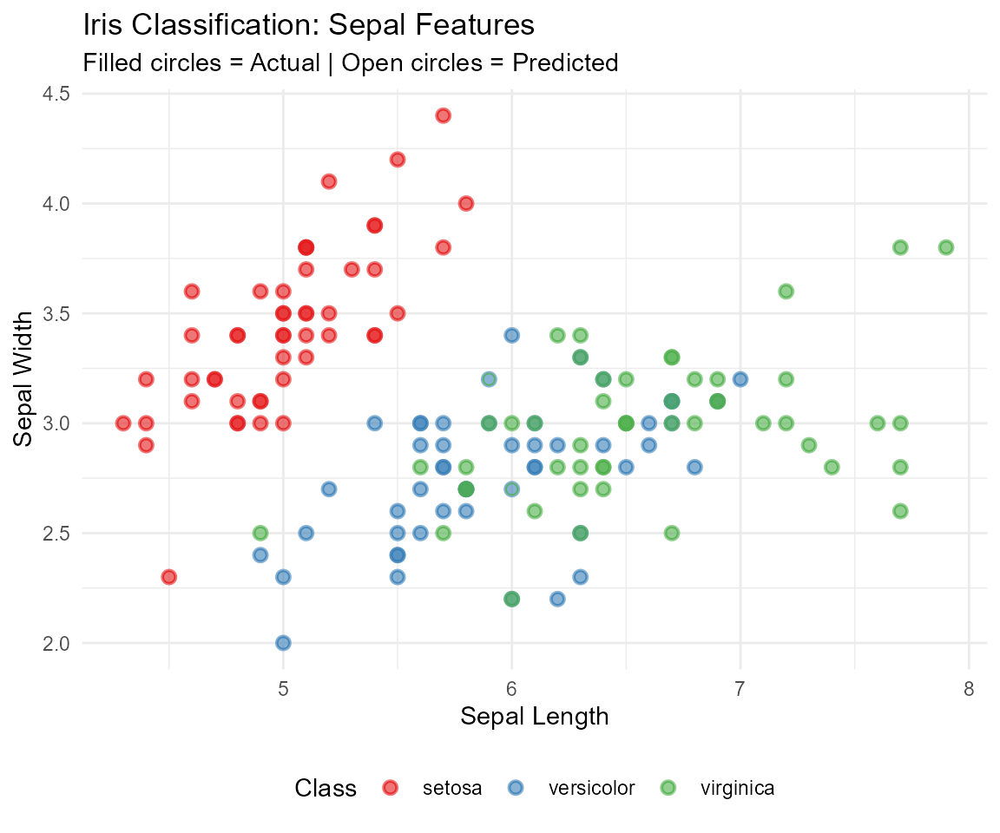
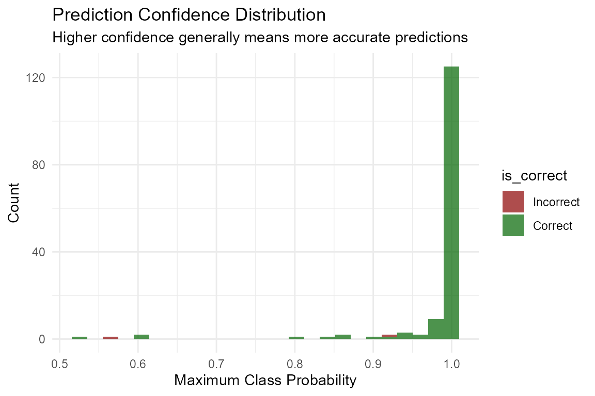
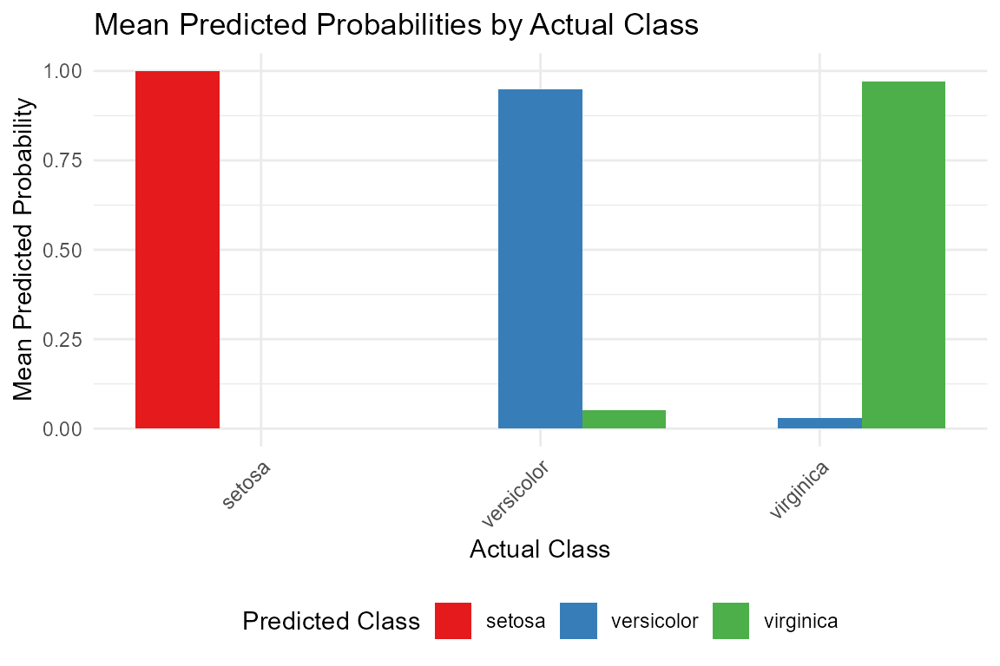
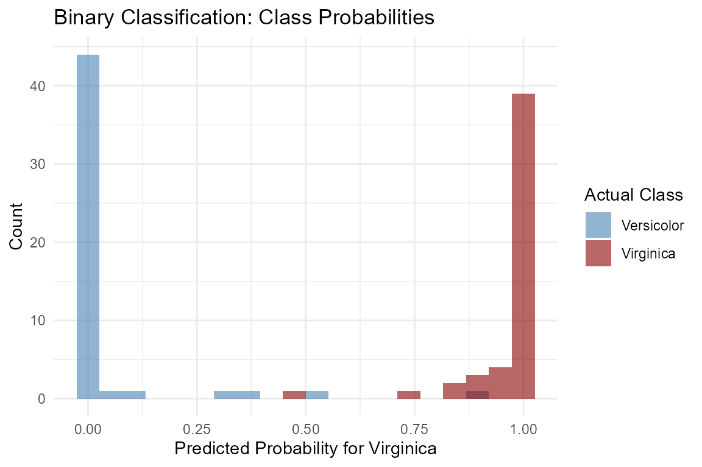

# Classification with TabPFN

## Introduction

The `rtabpfn` package provides a powerful interface for classification
tasks using the TabPFN (Tabular Prior-Fitted Network) foundation model.
TabPFN excels at tabular classification tasks, particularly on small
datasets, by leveraging prior knowledge from millions of datasets.

## Setup

First, ensure the Python environment is configured:

``` r

library(rtabpfn)
rtabpfn:::setup_tabpfn()
```

    ## Found TabPFN virtual environment at: C:/venvs/tabpfn/Scripts/python.exe

    ## Using Python: C:/venvs/tabpfn/Scripts/python.exe

    ## TabPFN environment ready!

Load required packages:

``` r

library(ggplot2)
library(dplyr)
```

    ## 
    ## Attaching package: 'dplyr'

    ## The following objects are masked from 'package:stats':
    ## 
    ##     filter, lag

    ## The following objects are masked from 'package:base':
    ## 
    ##     intersect, setdiff, setequal, union

``` r

library(tidyr)
```

## Basic Classification

Let’s use the classic `iris` dataset to classify flower species:

``` r

# Load data
data(iris)

# Prepare predictors and response
X <- iris[, c("Sepal.Length", "Sepal.Width", "Petal.Length", "Petal.Width")]
y <- iris$Species

# Train model
model <- tab_pfn_classification(X, y, device = "auto")

# Make predictions
class_preds <- predict(model, X, type = "class")

head(class_preds)
```

    ## # A tibble: 6 × 1
    ##   .pred_class
    ##   <fct>      
    ## 1 setosa     
    ## 2 setosa     
    ## 3 setosa     
    ## 4 setosa     
    ## 5 setosa     
    ## 6 setosa

## Probability Predictions

TabPFN can provide class probabilities, offering insight into prediction
confidence:

``` r

# Get class probabilities
prob_preds <- predict(model, X, type = "prob")

head(prob_preds)
```

    ## # A tibble: 6 × 3
    ##   .pred_setosa .pred_versicolor .pred_virginica
    ##          <dbl>            <dbl>           <dbl>
    ## 1        1.000      0.000000417    0.0000000596
    ## 2        1.000      0.00000131     0.000000119 
    ## 3        1.000      0.000000596    0.0000000596
    ## 4        1.000      0.000000954    0.000000119 
    ## 5        1.000      0.000000358    0.0000000596
    ## 6        1.000      0.00000286     0.000000238

## Model Evaluation

``` r

# Calculate accuracy
accuracy <- mean(class_preds$.pred_class == y)
cat("Model Accuracy:", round(accuracy, 4), "\n")
```

    ## Model Accuracy: 0.9867

``` r

# Confusion matrix
conf_matrix <- table(Actual = y, Predicted = class_preds$.pred_class)
print(conf_matrix)
```

    ##             Predicted
    ## Actual       setosa versicolor virginica
    ##   setosa         50          0         0
    ##   versicolor      0         48         2
    ##   virginica       0          0        50

## Visualizing Predictions

### Confusion Matrix Heatmap

``` r

# Create confusion matrix for plotting
conf_df <- as.data.frame(as.table(conf_matrix))
names(conf_df) <- c("Actual", "Predicted", "Count")

ggplot(conf_df, aes(x = Predicted, y = Actual, fill = Count)) +
  geom_tile(color = "white") +
  geom_text(aes(label = Count), color = "white", fontface = "bold") +
  scale_fill_gradient(low = "steelblue", high = "darkred") +
  labs(title = "Confusion Matrix",
       subtitle = paste("Accuracy:", round(accuracy, 4)),
       x = "Predicted Class",
       y = "Actual Class") +
  theme_minimal() +
  theme(axis.text.x = element_text(angle = 45, hjust = 1))
```


### Class Probabilities

``` r

# Add actual class to probabilities
prob_df <- prob_preds %>%
  mutate(actual_class = y)

# Reshape to long format for plotting
prob_long <- prob_df %>%
  pivot_longer(cols = starts_with(".pred_"), 
               names_to = "predicted_class", 
               values_to = "probability") %>%
  mutate(predicted_class = gsub("\\.pred_", "", predicted_class))

# Filter for correct predictions
prob_correct <- prob_long %>%
  mutate(correct = predicted_class == actual_class)

ggplot(prob_correct, aes(x = probability, fill = correct)) +
  geom_histogram(bins = 20, alpha = 0.7, position = "identity") +
  facet_wrap(~ actual_class) +
  scale_fill_manual(values = c("TRUE" = "darkgreen", "FALSE" = "darkred"),
                     labels = c("FALSE" = "Incorrect", "TRUE" = "Correct")) +
  labs(title = "Distribution of Predicted Probabilities",
       subtitle = "Separated by correct/incorrect predictions",
       x = "Predicted Probability",
       y = "Count") +
  theme_minimal() +
  theme(legend.position = "bottom")
```



### Feature Space Visualization

``` r

# Plot first two features with predictions
feature_df <- data.frame(
  Sepal.Length = iris$Sepal.Length,
  Sepal.Width = iris$Sepal.Width,
  Predicted = class_preds$.pred_class,
  Actual = iris$Species
)

ggplot(feature_df, aes(x = Sepal.Length, y = Sepal.Width)) +
  geom_point(aes(color = Actual), size = 3, alpha = 0.6, shape = 16) +
  geom_point(aes(color = Predicted), size = 2, alpha = 0.8, shape = 1) +
  scale_color_manual(values = c("setosa" = "#E41A1C", 
                                "versicolor" = "#377EB8", 
                                "virginica" = "#4DAF4A")) +
  labs(title = "Iris Classification: Sepal Features",
       subtitle = "Filled circles = Actual | Open circles = Predicted",
       x = "Sepal Length",
       y = "Sepal Width",
       color = "Class") +
  theme_minimal() +
  theme(legend.position = "bottom")
```



### Confidence Scores

``` r

# Calculate confidence (max probability)
prob_df$max_prob <- pmax(prob_df$.pred_setosa, 
                         prob_df$.pred_versicolor, 
                         prob_df$.pred_virginica)

prob_df$is_correct <- class_preds$.pred_class == y

ggplot(prob_df, aes(x = max_prob, fill = is_correct)) +
  geom_histogram(bins = 25, alpha = 0.7) +
  scale_fill_manual(values = c("TRUE" = "darkgreen", "FALSE" = "darkred"),
                     labels = c("FALSE" = "Incorrect", "TRUE" = "Correct")) +
  labs(title = "Prediction Confidence Distribution",
       subtitle = "Higher confidence generally means more accurate predictions",
       x = "Maximum Class Probability",
       y = "Count") +
  theme_minimal()
```



## Multi-Class Classification

TabPFN handles multi-class problems natively:

``` r

# Print class information
cat("Number of classes:", length(unique(y)), "\n")
```

    ## Number of classes: 3

``` r

cat("Classes:", paste(unique(y), collapse = ", "), "\n")
```

    ## Classes: setosa, versicolor, virginica

``` r

# Check probabilities per class
class_stats <- prob_preds %>%
  mutate(actual = as.character(y)) %>%
  group_by(actual) %>%
  summarise(
    n = n(),
    mean_prob = mean(.pred_setosa + .pred_versicolor + .pred_virginica),
    .groups = "drop"
  )

print(class_stats)
```

    ## # A tibble: 3 × 3
    ##   actual         n mean_prob
    ##   <chr>      <int>     <dbl>
    ## 1 setosa        50     1.00 
    ## 2 versicolor    50     1.00 
    ## 3 virginica     50     1.000

### Probability Comparison by Class

``` r

# Mean probabilities for each actual class
prob_mean <- prob_preds %>%
  mutate(actual = as.character(y)) %>%
  group_by(actual) %>%
  summarise(
    mean_setosa = mean(.pred_setosa),
    mean_versicolor = mean(.pred_versicolor),
    mean_virginica = mean(.pred_virginica),
    .groups = "drop"
  ) %>%
  pivot_longer(cols = starts_with("mean_"),
               names_to = "predicted_class",
               values_to = "mean_probability") %>%
  mutate(predicted_class = gsub("mean_", "", predicted_class))

ggplot(prob_mean, aes(x = actual, y = mean_probability, fill = predicted_class)) +
  geom_col(position = "dodge") +
  scale_fill_manual(values = c("setosa" = "#E41A1C", 
                                "versicolor" = "#377EB8", 
                                "virginica" = "#4DAF4A")) +
  labs(title = "Mean Predicted Probabilities by Actual Class",
       x = "Actual Class",
       y = "Mean Predicted Probability",
       fill = "Predicted Class") +
  theme_minimal() +
  theme(legend.position = "bottom",
        axis.text.x = element_text(angle = 45, hjust = 1))
```



## Using with tidymodels

TabPFN integrates seamlessly with the tidymodels ecosystem:

``` r

library(tidymodels)

# Create model specification
tabpfn_spec <- tab_pfn(mode = "classification") %>%
  set_engine("tabpfn")

# Fit using workflow
workflow <- workflow() %>%
  add_model(tabpfn_spec) %>%
  add_formula(Species ~ Sepal.Length + Sepal.Width + Petal.Length + Petal.Width)

fit_result <- workflow %>% 
  fit(iris)

# Make predictions
preds_tm <- predict(fit_result, iris, type = "prob")

# Evaluate
metrics <- fit_result %>%
  augment(iris) %>%
  metrics(truth = Species, estimate = .pred_class)

print(metrics)
```

## Handling Binary Classification

``` r

# Create binary classification problem
iris_binary <- iris %>%
  filter(Species != "setosa") %>%
  mutate(Species = factor(Species, levels = c("versicolor", "virginica")))

X_bin <- iris_binary[, c("Sepal.Length", "Sepal.Width", "Petal.Length", "Petal.Width")]
y_bin <- iris_binary$Species

# Train model
model_bin <- tab_pfn_classification(X_bin, y_bin, device = "auto")

# Get predictions
preds_bin <- predict(model_bin, X_bin, type = "prob")
class_preds_bin <- predict(model_bin, X_bin, type = "class")

# ROC-style plot
roc_df <- data.frame(
  prob_virginica = preds_bin$.pred_virginica,
  actual = ifelse(y_bin == "virginica", 1, 0),
  predicted = ifelse(class_preds_bin$.pred_class == "virginica", 1, 0)
)

ggplot(roc_df, aes(x = prob_virginica, fill = factor(actual))) +
  geom_histogram(bins = 20, alpha = 0.6, position = "identity") +
  scale_fill_manual(values = c("0" = "steelblue", "1" = "darkred"),
                     labels = c("0" = "Versicolor", "1" = "Virginica")) +
  labs(title = "Binary Classification: Class Probabilities",
       x = "Predicted Probability for Virginica",
       y = "Count",
       fill = "Actual Class") +
  theme_minimal()
```



## Summary

TabPFN provides excellent classification performance with intuitive
probability estimates. Key features:

- **Multi-class support**: Handles binary and multi-class problems
  natively
- **Probability estimates**: Provides calibrated class probabilities
- **Tidymodels integration**: Works seamlessly with the tidymodels
  ecosystem
- **Small data performance**: Excels on datasets with limited samples
- **No hyperparameter tuning**: Ready to use out of the box

The model is particularly effective for: - Quick prototyping on tabular
data - Small to medium-sized datasets - Problems requiring probability
estimates - Rapid iteration without extensive tuning
