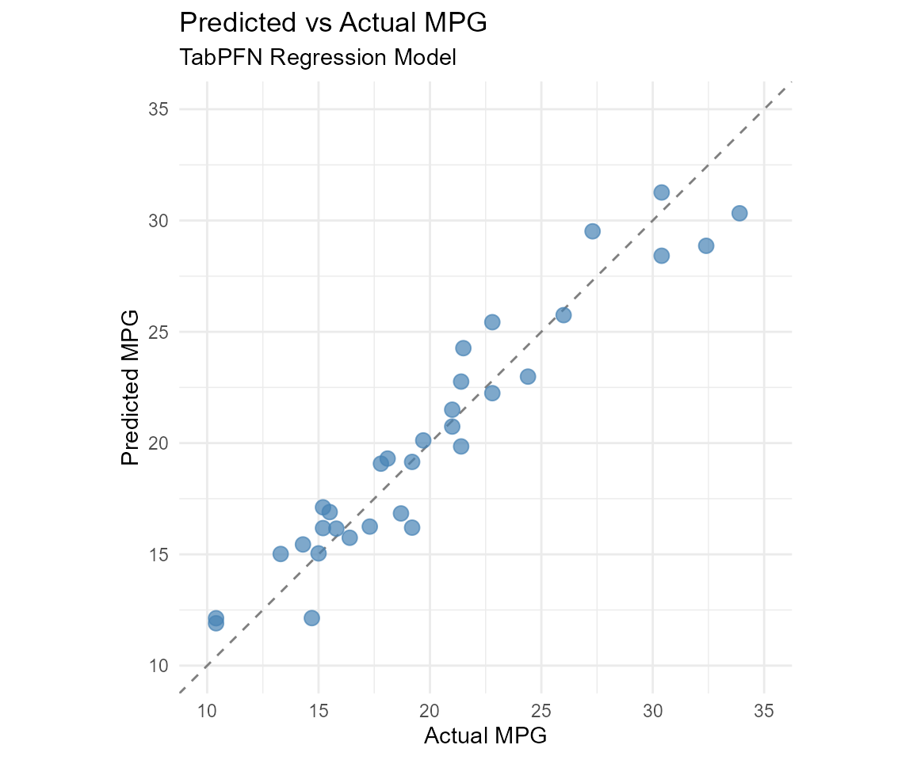
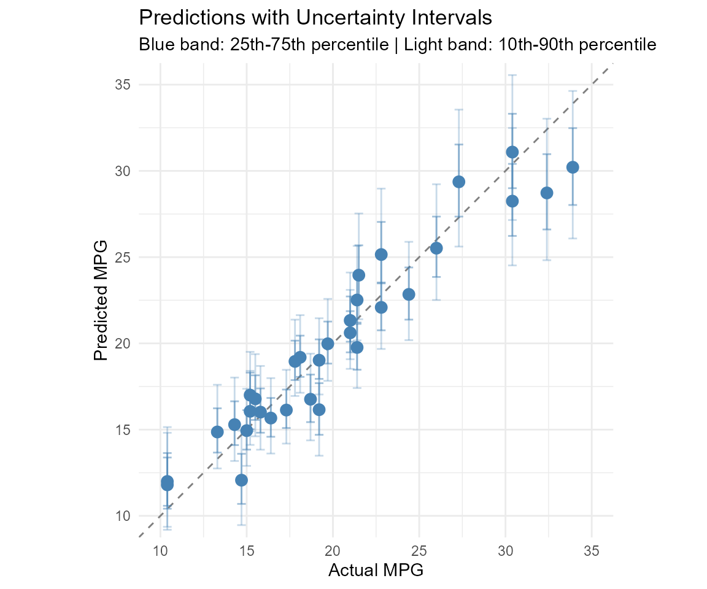
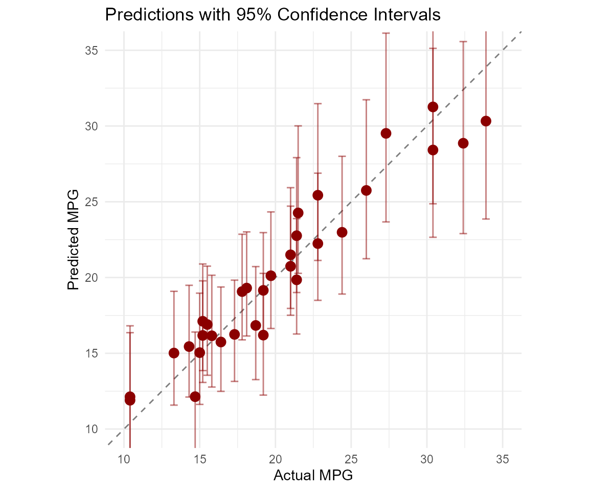
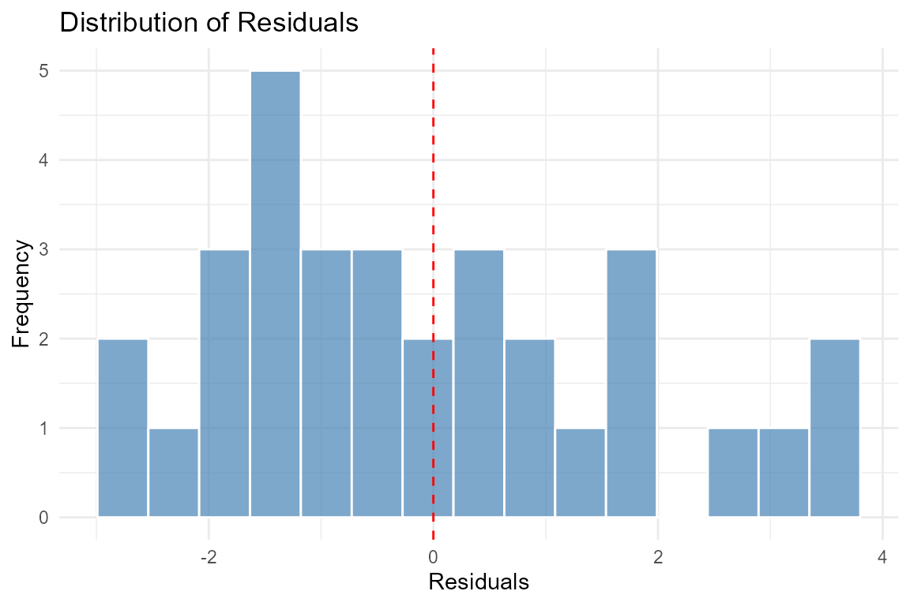
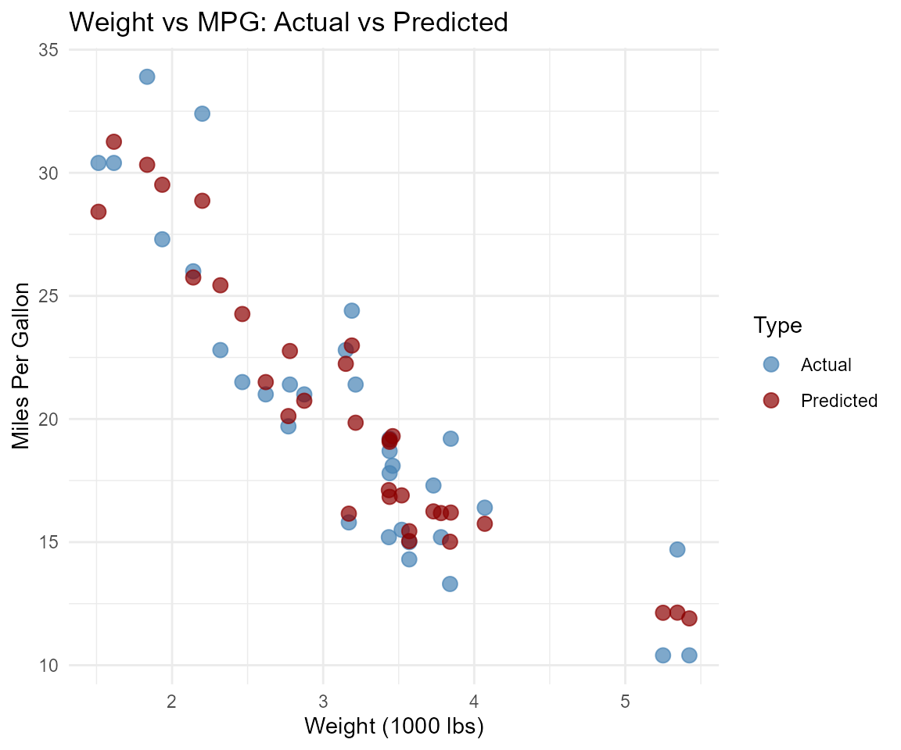

# Regression with TabPFN

## Introduction

The `rtabpfn` package provides a powerful interface for regression tasks
using the TabPFN (Tabular Prior-Fitted Network) foundation model. TabPFN
leverages prior knowledge from millions of datasets to achieve excellent
predictive performance, especially on small datasets.

## Setup

First, ensure the Python environment is configured:

    ## Using virtual environment "tabpfn" ...

    ## Using virtual environment "tabpfn" ...

    ## PyTorch CUDA Available: TRUE 
    ## CUDA Version: 12.8 
    ## Device Count: 1 
    ## Device: NVIDIA GeForce RTX 5070 Laptop GPU

Load required packages:

``` r

library(ggplot2)
library(dplyr)
```

    ## 
    ## Attaching package: 'dplyr'

    ## The following objects are masked from 'package:stats':
    ## 
    ##     filter, lag

    ## The following objects are masked from 'package:base':
    ## 
    ##     intersect, setdiff, setequal, union

``` r

library(tidyr)
```

## Basic Regression

Let’s use the `mtcars` dataset to predict miles per gallon (mpg) based
on engine characteristics:

``` r

# Load data
data(mtcars)

# Prepare predictors and response
X <- mtcars[, c("cyl", "disp", "hp", "wt", "qsec")]
y <- mtcars$mpg

# Train model
model <- tab_pfn_regression(X, y, device = "auto")

# Make predictions
preds <- predict(model, X, type = "numeric")

head(preds)
```

    ## # A tibble: 6 × 1
    ##   .pred
    ##   <dbl>
    ## 1  21.5
    ## 2  20.7
    ## 3  25.4
    ## 4  19.8
    ## 5  16.8
    ## 6  19.3

## Quantile Predictions

TabPFN supports quantile predictions, providing uncertainty estimates
for your predictions:

``` r

# Get quantile predictions
quantile_preds <- predict(model, X, 
                          type = "quantiles",
                          quantiles = c(0.1, 0.25, 0.5, 0.75, 0.9))

head(quantile_preds)
```

    ## # A tibble: 6 × 5
    ##   .pred_q010 .pred_q025 .pred_q050 .pred_q075 .pred_q090
    ##        <dbl>      <dbl>      <dbl>      <dbl>      <dbl>
    ## 1       19.1       20.1       21.3       22.7       24.1
    ## 2       18.5       19.5       20.6       21.9       23.1
    ## 3       22.3       23.5       25.2       27.0       29.0
    ## 4       17.4       18.5       19.8       21.1       22.3
    ## 5       14.4       15.4       16.8       18.2       19.4
    ## 6       17.1       18.1       19.2       20.4       21.6

## Visualizing Predictions

### Predictions vs Actual

``` r

# Combine predictions with actual values
df <- data.frame(
  actual = y,
  predicted = preds$.pred
)

ggplot(df, aes(x = actual, y = predicted)) +
  geom_abline(intercept = 0, slope = 1, linetype = "dashed", color = "gray50") +
  geom_point(color = "steelblue", size = 3, alpha = 0.7) +
  labs(title = "Predicted vs Actual MPG",
       subtitle = "TabPFN Regression Model",
       x = "Actual MPG",
       y = "Predicted MPG") +
  theme_minimal() +
  coord_fixed(xlim = c(10, 35), ylim = c(10, 35))
```



### Uncertainty Intervals

``` r

# Create dataframe with quantiles
df_quant <- data.frame(
  actual = y,
  median = quantile_preds$.pred_q050,
  q25 = quantile_preds$.pred_q025,
  q75 = quantile_preds$.pred_q075,
  q10 = quantile_preds$.pred_q010,
  q90 = quantile_preds$.pred_q090
)

ggplot(df_quant, aes(x = actual, y = median)) +
  geom_abline(intercept = 0, slope = 1, linetype = "dashed", color = "gray50") +
  geom_errorbar(aes(ymin = q10, ymax = q90), 
                width = 0.5, alpha = 0.3, color = "steelblue") +
  geom_errorbar(aes(ymin = q25, ymax = q75), 
                width = 0.5, alpha = 0.5, color = "steelblue") +
  geom_point(color = "steelblue", size = 3) +
  labs(title = "Predictions with Uncertainty Intervals",
       subtitle = "Blue band: 25th-75th percentile | Light band: 10th-90th percentile",
       x = "Actual MPG",
       y = "Predicted MPG") +
  theme_minimal() +
  coord_fixed(xlim = c(10, 35), ylim = c(10, 35))
```



### Prediction Intervals

``` r

# Get 95% confidence intervals
conf_preds <- predict(model, X, type = "conf_int", level = 0.95)

df_conf <- data.frame(
  actual = y,
  predicted = predict(model, X, type = "numeric")$.pred,
  lower = conf_preds$.pred_lower,
  upper = conf_preds$.pred_upper
)

ggplot(df_conf, aes(x = actual, y = predicted)) +
  geom_abline(intercept = 0, slope = 1, linetype = "dashed", color = "gray50") +
  geom_errorbar(aes(ymin = lower, ymax = upper), 
                width = 0.5, alpha = 0.5, color = "darkred") +
  geom_point(color = "darkred", size = 3) +
  labs(title = "Predictions with 95% Confidence Intervals",
       x = "Actual MPG",
       y = "Predicted MPG") +
  theme_minimal() +
  coord_fixed(xlim = c(10, 35), ylim = c(10, 35))
```



## Residual Analysis

``` r

# Calculate residuals
df_resid <- data.frame(
  predicted = preds$.pred,
  residual = y - preds$.pred
)

# Residual plot
ggplot(df_resid, aes(x = predicted, y = residual)) +
  geom_hline(yintercept = 0, linetype = "dashed", color = "gray50") +
  geom_point(color = "steelblue", size = 3, alpha = 0.7) +
  labs(title = "Residual Plot",
       subtitle = "Residuals vs Fitted Values",
       x = "Predicted Values",
       y = "Residuals") +
  theme_minimal()
```


``` r

# Histogram of residuals
ggplot(df_resid, aes(x = residual)) +
  geom_histogram(bins = 15, fill = "steelblue", color = "white", alpha = 0.7) +
  geom_vline(xintercept = 0, linetype = "dashed", color = "red") +
  labs(title = "Distribution of Residuals",
       x = "Residuals",
       y = "Frequency") +
  theme_minimal()
```



## Feature Relationships

``` r

# Relationship between weight and MPG
df_wt <- data.frame(
  wt = mtcars$wt,
  actual_mpg = mtcars$mpg,
  pred_mpg = preds$.pred
)

ggplot(df_wt, aes(x = wt)) +
  geom_point(aes(y = actual_mpg, color = "Actual"), size = 3, alpha = 0.7) +
  geom_point(aes(y = pred_mpg, color = "Predicted"), size = 3, alpha = 0.7) +
  labs(title = "Weight vs MPG: Actual vs Predicted",
       x = "Weight (1000 lbs)",
       y = "Miles Per Gallon",
       color = "Type") +
  scale_color_manual(values = c("Actual" = "steelblue", "Predicted" = "darkred")) +
  theme_minimal()
```



## Using with tidymodels

TabPFN also integrates with the tidymodels ecosystem:

``` r

library(tidymodels)

# Create model specification
tabpfn_spec <- tab_pfn(mode = "regression") %>%
  set_engine("tabpfn")

# Fit using workflow
workflow <- workflow() %>%
  add_model(tabpfn_spec) %>%
  add_formula(mpg ~ cyl + disp + hp + wt + qsec)

fit_result <- workflow %>%
  fit(mtcars)

# Make predictions
preds_tm <- predict(fit_result, mtcars)
```

## Summary

TabPFN provides excellent regression performance with built-in
uncertainty estimation through quantile predictions. The model is
particularly effective for: - Small to medium-sized datasets - Quick
prototyping without extensive hyperparameter tuning - When uncertainty
estimates are needed

Key features demonstrated: - Point predictions with `type = "numeric"` -
Quantile predictions for uncertainty estimation - Prediction intervals
with configurable confidence levels - Integration with tidymodels
ecosystem
